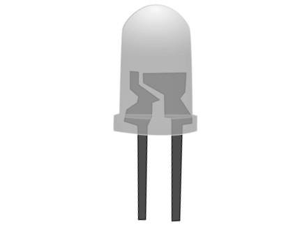
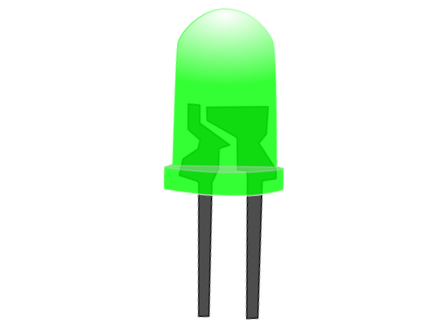

#### Gray to Binary Conversion

Step-1) Connect  battery to supply 5V to the circuit.  
Step-2) Press Switches for different inputs. 
        The switch in ON state is  and the switch in OFF state is  
Step-3) The corresponding combination of input and output LEDs lit up for different combination of inputs. 
        The input gray code LEDs are G3,G2,G1 and G0 and the output binary code LEDs B3,B2,B1 and B0 glow accordingly. 
        The input LED in OFF state is  and in ON state is  . 
        The output LED in OFF state is  and in ON state is  . 
Step-4) Click "Add" to add the values to the Truth Table.   
Step-5) Click "Print" to get the print out of the Truth Table.   

#### Binary to Gray Code Conversion

Step-1) Connect  battery to supply 5V to the circuit.  
Step-2) Press Switches for different inputs. 
        The switch in ON state is  and the switch in OFF state is  
Step-3) The corresponding combination of input and output LEDs lit up for different combination of inputs. 
        The input binary code LEDs are B3,B2,B1 and B0 and the output gray code LEDs G3,G2,G1 and G0 glow accordingly. 
        The input LED in OFF state is  and in ON state is  . 
        The output LED in OFF state is  and in ON state is  . 
Step-4) Click "Add" to add the values to the Truth Table.   
Step-5) Click "Print" to get the print out of the Truth Table.   
