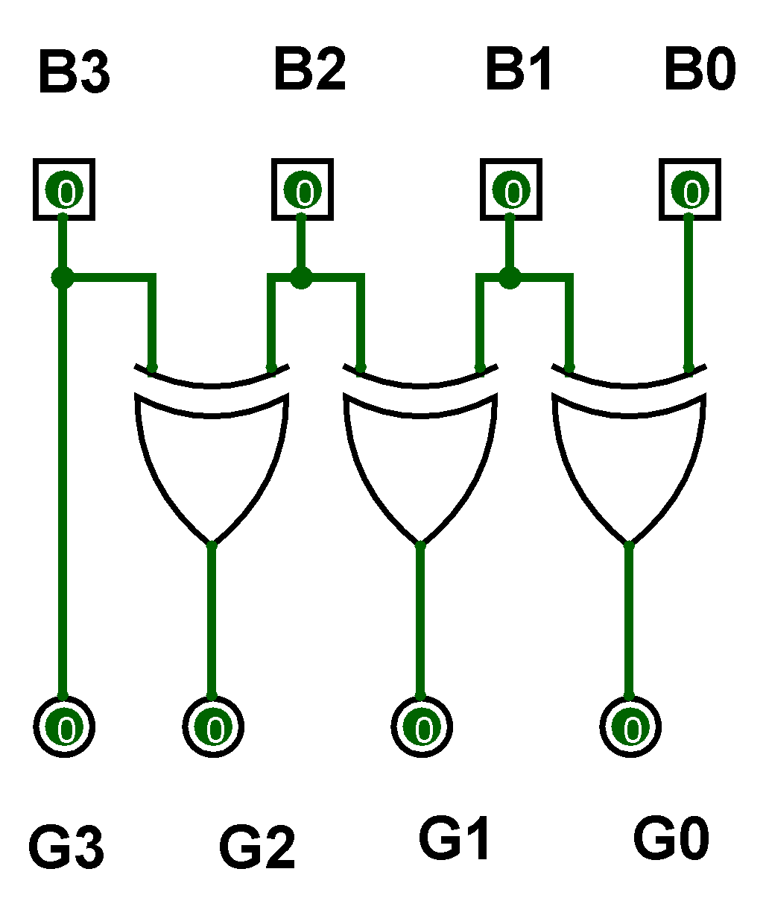
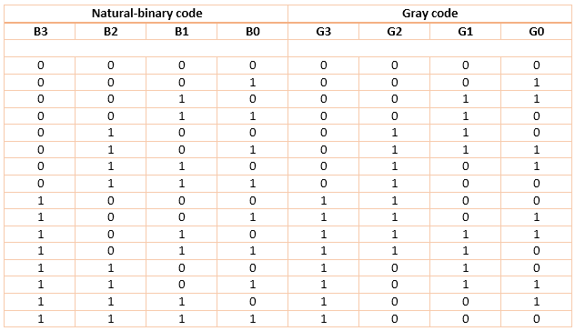
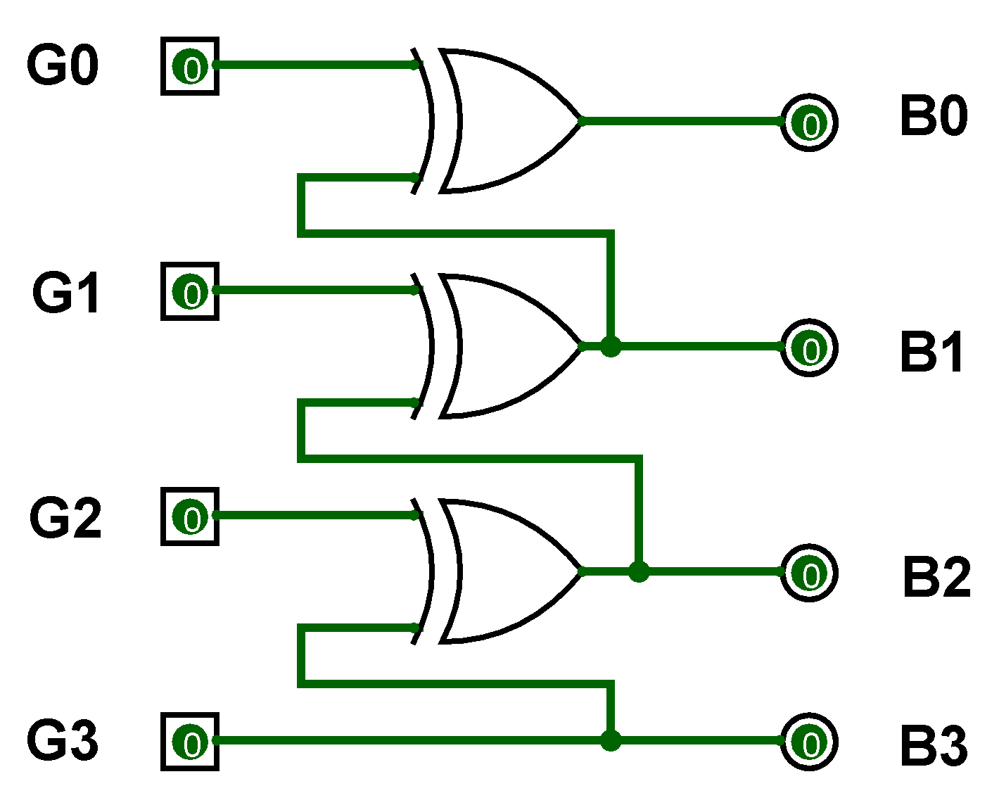
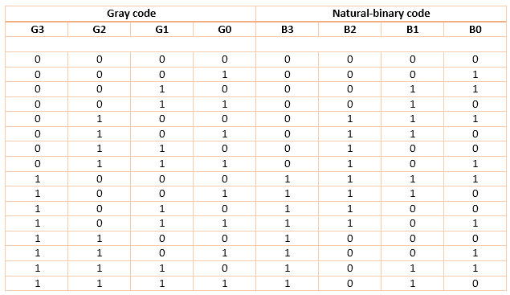

### Introduction

Binary Numbers is default way to store numbers, but in many applications binary numbers are difficult to use and a variation of binary numbers is needed. Gray code is an ordering of the binary numeral system such that two successive values differ in only one bit (binary digit). Gray codes are very useful in the normal sequence of binary numbers generated by the hardware that may cause an error or ambiguity during the transition from one number to the next. So, the Gray code can eliminate this problem easily since only one bit changes its value during any transition between two numbers.  
Gray code has property that two successive numbers differ in only one bit because of this property gray code does the cycling through various states with minimal effort and used in K-maps, error correction, communication etc.  In computer science many a times we need to convert binary code to gray code and vice versa. This conversion can be done by applying following rules : 

### 1) Binary to Gray conversion : 
1. The Most Significant Bit (MSB) of the gray code is always equal to the MSB of the given binary code. 
2. Other bits of the output gray code can be obtained by Ex-ORing binary code bit at that index and previous index.  
There are four inputs and four outputs. The input variable are defined as B3, B2, B1, B0 and the output variables are defined as G3, G2, G1, G0. From the truth table, combinational circuit is designed.The logical expressions are defined as :  

<b>B3 = G3 

B2 ⊕ B3 = G2 

B1 ⊕ B2 = G1 

B0 ⊕ B1 = G0</b>  

  <b>Figure-1: Binary to Gray Code Converter Circuit</b> 
  <b> Figure-2: Binary to Gray Code Converter Truth Table</b> 

#### 2) Gray to binary conversion :

1.The Most Significant Bit (MSB) of the binary code is always equal to the MSB of the given binary number. 
2.Other bits of the output binary code can be obtained by checking gray code bit at that index. If current gray code bit is 0, then copy previous binary code bit, else copy invert of previous binary code bit.   There are four inputs and four outputs. The input variable are defined as G3, G2, G1, G0 and the output variables are defined as B3, B2, B1, B0. From the truth table, combinational circuit is designed.The logical expressions are defined as :  

<b>G0 ⊕ G1 ⊕ G2 ⊕ G3 = B0 

G1 ⊕ G2 ⊕ G3 = B1 

G2 ⊕ G3 = B2 

G3 = B3 </b>  

  <b>Figure-3: Gray to Binary Code Converter Circuit</b> 
  <b>Figure-4: Gray to Binary Code Converter Truth Table </b> 

